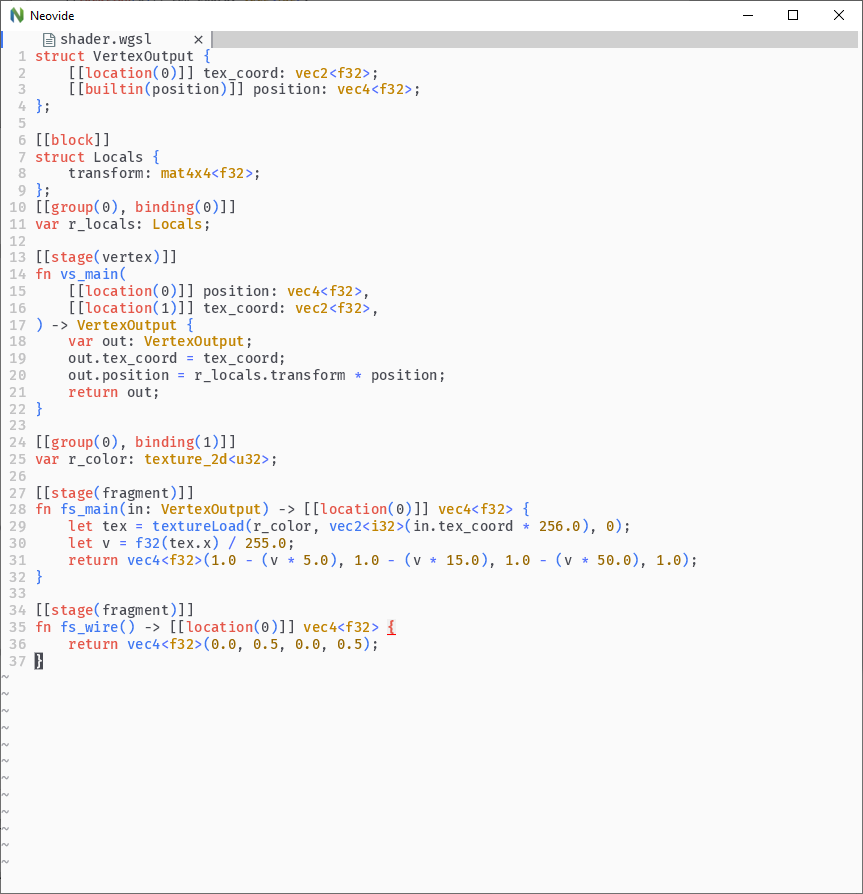
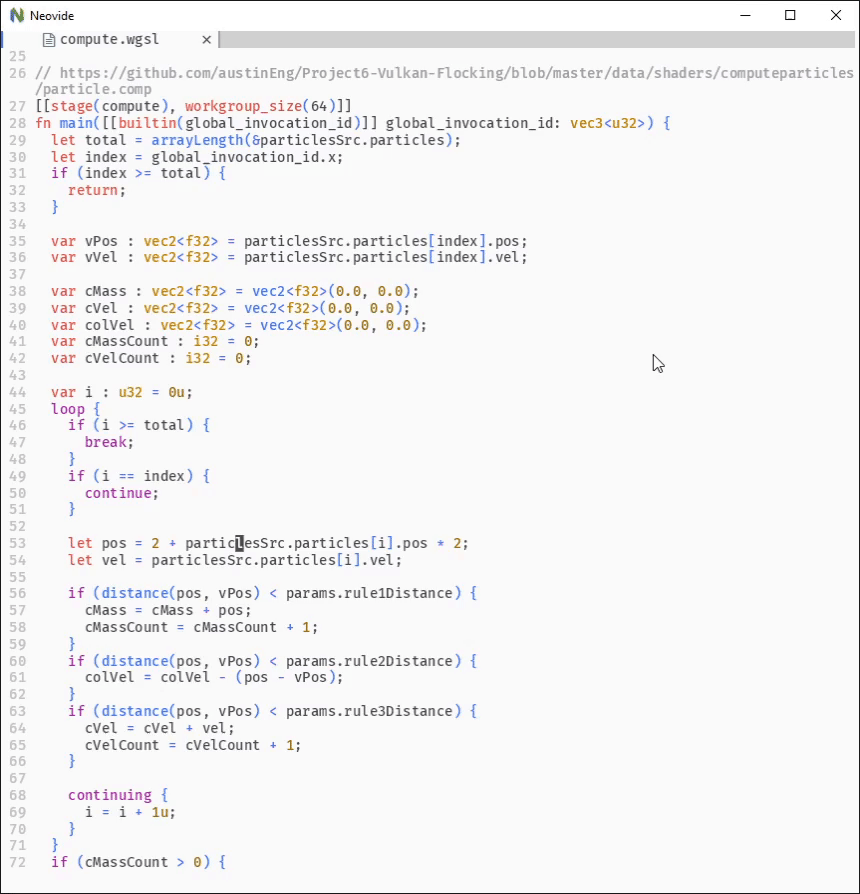
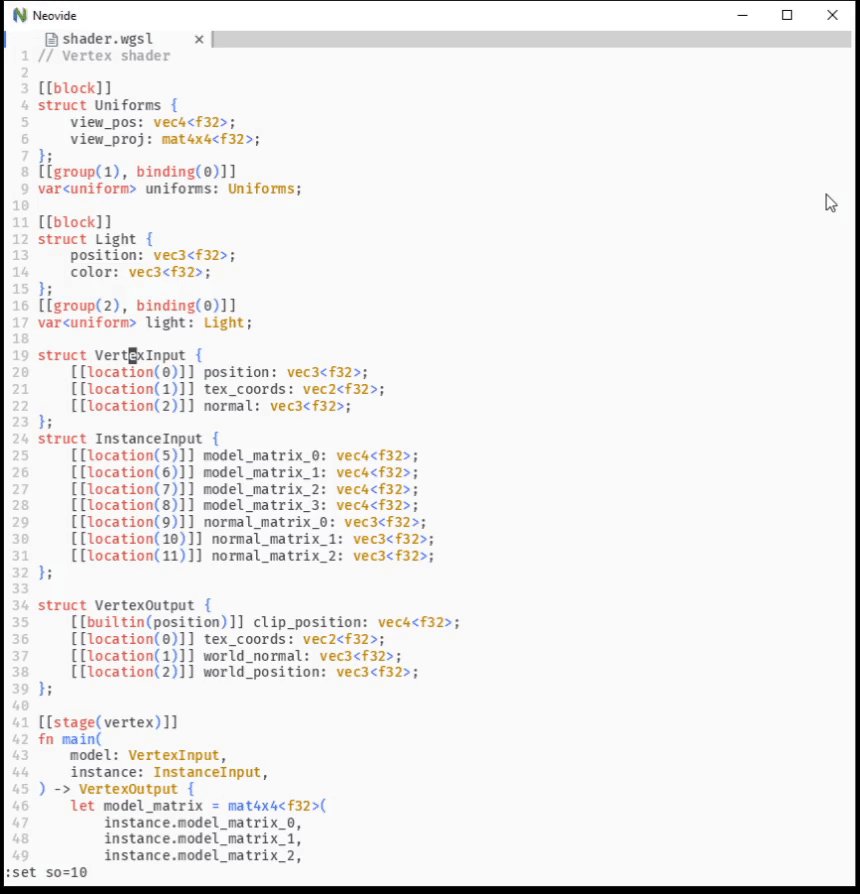

<div align="center">
    <h1>
        tree-sitter-wgsl
	</h1>
    <p>
        <a href="https://www.w3.org/TR/WGSL/">WebGPU Shading Language (WGSL)</a> grammar for <a href="https://tree-sitter.github.io/tree-sitter/">tree-sitter</a> parser
    </p>
</div>

## About

The goal of this project is to provide a grammar for [WebGPU Shading Lanugage (WGSL)](https://www.w3.org/TR/WGSL/) that would enable [tree-sitter](https://tree-sitter.github.io/tree-sitter/) to efficiently bulid a syntax tree for a source file.

WGSL is a shading language created as a part of [WebGPU](https://www.w3.org/community/gpu/) &#x2014; future web standard that aims to provide "modern 3D graphics and computation capabilities".

Please note that both the WebGPU and WGSL spec are still under development.

## Showcase

### Code highlighting



### Incremental selection



### Folding


## Setup

*The instructions below are provided for [Neovim](https://neovim.io/) 0.5 and [nvim-treesitter](https://github.com/nvim-treesitter/nvim-treesitter), but it should be possible to get it running in any environment supporting tree-sitter parsers. I am making an assumption that you are using `init.lua` config file*

1. Begin by installing `nvim-treesitter` using your favorite package manager. E.g., if you are using [packer.nvim](https://github.com/wbthomason/packer.nvim):

    ```lua
    require('packer').startup(function()
        -- ...some other packages...
        use { 'nvim-treesitter/nvim-treesitter', run = ':TSUpdate' }
    end)
    ```

2. Add the following snippet to your config file:

   ```lua
   vim.cmd[[au BufRead,BufNewFile *.wgsl	set filetype=wgsl]]
   
   local parser_config = require "nvim-treesitter.parsers".get_parser_configs()
   parser_config.wgsl = {
       install_info = {
           url = "https://github.com/szebniok/tree-sitter-wgsl",
           files = {"src/parser.c"}
       },
   }
   
   require'nvim-treesitter.configs'.setup {
       ensure_installed = {"wgsl"},
       highlight = {
           enable = true
       },
       incremental_selection = {
           enable = true,
           keymaps = {
               init_selection = "gnn",
               node_incremental = "grn",
               scope_incremental = "grc",
               node_decremental = "grm",
           },
       },
   }
   
   vim.wo.foldmethod = "expr"
   vim.wo.foldexpr = "nvim_treesitter#foldexpr()"
   vim.o.foldlevelstart = 99 -- do not close folds when a buffer is opened
   ```
   
3. Copy&#x200A;/&#x200A;Symlink&#x200A;/&#x200A;Whatever the files from [queries folder](https://github.com/szebniok/tree-sitter-wgsl/tree/master/queries) to `$LOCATION_OF_YOUR_CONFIG_FILE/queries/wgsl` folder 

4. Start `nvim` &#x2014; the installation of wgsl grammar should begin automatically
5. Restart `nvim` &#x2014; all `*.wgsl` files should be handled properly now.

## License

Distributed under the MIT License. See `LICENSE` for more information.

## References

* [WebGPU Shading Language Working Draft](https://www.w3.org/TR/WGSL/)